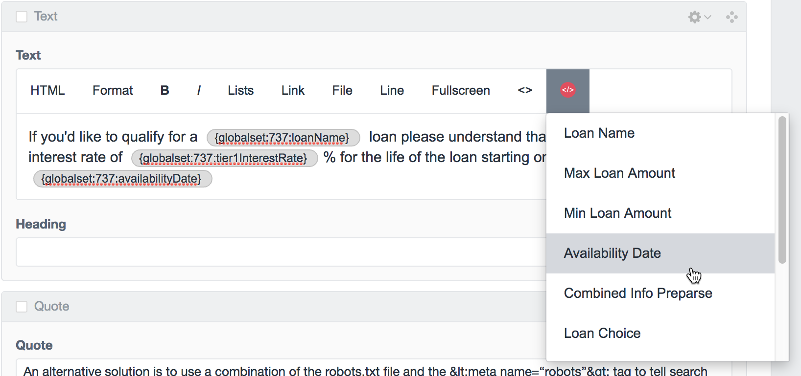
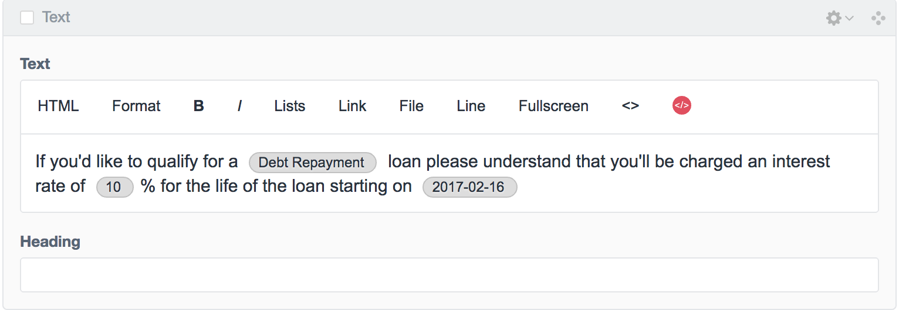

# Rich Variables plugin for Craft CMS

Allows you to easily use Craft Globals as variables in Rich Text fields

Related: [Rich Variables for Craft 3.x](https://github.com/nystudio107/craft3-richvariables)

## Installation

To install Rich Variables, follow these steps:

1. Download & unzip the file and place the `richvariables` directory into your `craft/plugins` directory
2.  -OR- do a `git clone https://github.com/nystudio107/richvariables.git` directly into your `craft/plugins` folder.  You can then update it with `git pull`
3.  -OR- install with Composer via `composer require nystudio107/richvariables`
4. Install plugin in the Craft Control Panel under Settings > Plugins
5. The plugin folder should be named `richvariables` for Craft to see it.  GitHub recently started appending `-master` (the branch name) to the name of the folder for zip file downloads.

Rich Variables works on Craft 2.5.x and Craft 2.6.x.

## Rich Variables Overview

Rich Variables allows you to easily use Craft Globals as variables in Rich Text fields.

For instance, you might have loan rates that appear in the body of multiple Rich Text fields, and maybe even in multiple places in each field. When it comes time to update those loan rates, you can just change them in your Globals set, and they will be automatically updated wherever they are used in your Rich Text fields.

## Configuring Rich Variables

To configure Rich Variables, first you'll need to create a Globals set (if you don't have one already) by clicking on **Settings**→**Globals**:

You can put any kinds of fields that you want into your Globals set, but Rich Variables only recognizes the following FieldTypes currently: `PlainText`, `Number`, `Date`, `Dropdown`, and `Preparse`.

Next, you need to tell Rich Variables which Globals set (you can have an arbitrary number of them) that it should use. To do this, click on **Settings**→**Rich Variables** and choose your Globals set, then click on **Save**:

Finally, we'll need to let Redactor (the Craft 2.x Rich Text editor) know that we want to use the Rich Variables plugin. You can do this by editing the Redactor settings in `craft/config/redactor/`. Make sure you edit the settings that your Rich Text fields use to add `richvariables` to the `plugins` array.

For example, here's what my `Standard.json` Redactor settings looks like:

    {
        "buttons": ["format","kbd","bold","italic","lists","link","file","horizontalrule"],
        "plugins": ["source","fullscreen","richvariables"]
    }

Note that `richvariables` was added to the `plugins` array above.

If Rich Variables isn't appearing in your Rich Text fields, it's usually because the Rich Text fields aren't using the Redactor settings where you added `richvariables` to the `plugins` array.

## Using Rich Variables

The setup was the hard part. Using Rich Variables is easy, just go to your Rich Text field, and click on the newly added Rich Variables icon to see a list of your Globals set variables:

Choose one to insert it into your Rich Text field. You'll see some code-looking stuff inserted, such as `{globalset:737:loanName}` in the example above.

This is actually a [Reference Tag](https://craftcms.com/docs/reference-tags) to the Globals set Element and Field that you chose. But that needn't concern you, because once you save the Entry, it will appear like this:

...with a tokenized display of the actual value that is in your Globals set Fields. If you change the values in your Globals set Fields, they will automatically be updated everywhere they are used in your Rich Text fields.

On the frontend, the display of the Rich Text field will also automatically include the Globals set values, and might look something like this:

The fun thing about the way Rich Variables works is that since it leverages the built-in Craft functionality of [Reference Tags](https://craftcms.com/docs/reference-tags), even if you uninstall the Rich Variables plugin, everything will continue to work.

Nice.

## Miscellanea

To display itself in a tokenized way, Rich Variables wraps the inserted variables in `<ins></ins>` tags. The default styling for these seldom-used tags is `text-decoration: underline;` in many browsers. So for frontend display, you might need to add some CSS to override this if you don't want them underlined.

Redactor can be a little weird with inline styles; this isn't anything specific to Rich Variables. What I typically do is when I want to insert an inline style, I type two spaces, then the left-arrow key, and then I insert my inline style in Redactor. This ensures that there is a space on either side of the inline style, and prevents some formatting headaches.

## Rich Variables Roadmap

Some things to do, and ideas for potential features:

* Rich Variables could potentially have different Global sets for different Channels
* We could allow for things other than Global sets to be available for insertion, such as Entry values, Categories, etc.

Brought to you by [nystudio107](https://nystudio107.com)
